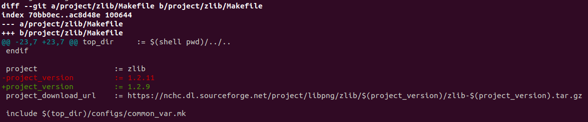

# Cross-compiling third-party libraries(交叉编译第三方库)

<!-- vim-markdown-toc GFM -->

- [项目说明](#项目说明)
  - [项目特点](#项目特点)
  - [项目组成](#项目组成)
- [使用说明](#使用说明)
  - [编译](#编译)
  - [增加新的项目](#增加新的项目)
  - [编译指定版本](#编译指定版本)
  - [手动下载大软件包](#手动下载大软件包)
  - [编译`mcu`版本](#编译mcu版本)
- [相关说明文档](#相关说明文档)
- [thanks](#thanks)

<!-- vim-markdown-toc -->

## 项目说明

* 该项目旨在更加方便的编译(交叉编译)第三方库
* 学习`autotools`，`cmake`，`Makefile`的使用方法
* 把第三方库的编译集中到一起，避免重复劳动提供效率

### 项目特点

* 使用`Makefile`组织，用`make`进行编译
* 抽离出跟平台相关的配置信息，如`gcc`
* `一键编译`(只需要指定软件版本，框架会去官方下载版本并编译，然后安装到指定的目录)

> 交叉编译时，部分`gcc`可能会有问题，可以尝试修改并提交pr，也可以直接提`Issues`

### 项目组成

```shell
.
├── build                               // 编译输出目录
│   ├── fullhan
│   │   ├── htop-2.2.0
│   │   ├── ncurses-6.1
│   │   └── zlib-1.2.12
│   ├── fullhan
│   │   ├── htop-2.2.0
│   │   ├── ncurses-6.1
│   │   └── zlib-1.2.12
│   └── pc
│       ├── htop-2.2.0
│       ├── ncurses-6.1
│       └── zlib-1.2.12
├── configs                             // 配置文件
│   ├── cmd.mk
│   ├── common_var.mk
│   ├── makefile
│   │   ├── check_lib.mk
│   │   ├── common_sub_target.mk
│   │   ├── common_target.mk
│   │   └── define_func.mk
│   └── vender                          // 厂商信息
│       ├── actions                     // 炬芯
│       │   └── ats3607d
│       │       └── config.mk
│       ├── allwinnertech               // 全志
│       │   └── r328
│       │       └── config.mk
│       ├── arterytek                   // 雅特力
│       │   └── at32f4xx
│       │       └── config.mk
│       ├── eeasytech                   // 亿智
│       │   └── SV823
│       │       └── config.mk
│       ├── fullhan                     // 富翰微
│       │   ├── MC3312
│       │   │   └── config.mk
│       │   └── MC6810E
│       │       └── config.mk
│       ├── hisilicon                   // 海思
│       │   └── 3536DV100
│       │       └── config.mk           // 交叉编译gcc配置信息
│       ├── ingenic                     // 君正
│       │   └── x1830
│       │       └── config.mk
│       ├── pc                          // pc
│       │   └── pc-chip
│       │       └── config.mk
│       ├── platform_config.mk          // 平台配置文件
│       ├── platform_config_tmp.mk      // 平台配置文件，覆盖上面文件的相关变量
│       ├── rock-chips                  // 瑞芯微
│       │   └── rk3308
│       │       └── config.mk
│       └── unisound                    // 云之声
│           └── unione
│               └── config.mk
├── img
├── LICENSE
├── Makefile                            // 顶层Makefile
├── project                             // 第三方库
│   ├── compress
│   │   ├── README.md
│   │   ├── xz
│   │   │   ├── Makefile
│   │   │   └── README.md
│   │   └── zlib
│   │       ├── Makefile                // 第三方编译Makefile
│   │       └── README.md
│   ├── detect_tools
│   │   └── htop
│   │       ├── Makefile
│   │       └── README.md
├── README.md
├── src                                 // 源码目录
├── SUMMARY.md
└── tools
    ├── tree2dotx
    └── tree2svg
```

## 使用说明

### 编译

* 配置对应的厂商

```shell
vim configs/vender/platform_config.mk

# 可选的厂商有: 
# actions
#   ats3607d
# allwinnertech
#   r328
# arterytek
#   at32f4xx
# eeasytech
#   SV823
# fullhan
#   MC6810E
#   MC3312
# hisilicon
#   3536DV100
# ingenic
#   x1830
# pc
#   pc-chip
# rock-chips
#   rk3308
# unisound
#   unione
vender := pc
chip := pc-chip
```

> 如果没有对应的厂商，可以增加相应的厂商配置文件

* 默认为编译pc版本

```makefile
vim configs/vender/pc.mk

gcc_version         := x86_64-linux-gnu

toolchains_path     :=
gcc_prefix          :=
host                := x86_64-linux-gnu

cppflags_com        :=
cflags_com          :=
cxxflags_com        :=
ldflags_com         :=
libs_com            := 

prefix_path         ?= /mnt/data/nfs/$(vender)/$(chip)         // 安装目录
```

> note:
>
> 1, host应该和build一样 (我这里使用的是`x86_64-linux-gnu`，系统版本是`20.04.1-Ubuntu-x86_64`)
>
> 2, 需要更改安装路径 (上面是我默认的安装目录)

* 修改gcc配置

```makefile
vim configs/vender/fullhan/MC6810E/config.mk

cross_gcc           := /mnt/data/toolchain/molchip/MC6810E/molchipv500-armgcc-uclibc/bin/arm-mol-linux-uclibcgnueabihf-
program_prefix      := arm-mol-linux-uclibcgnueabihf-
host                := arm-mol-linux-uclibcgnueabihf

cppflags_com        :=
cflags_com          :=
cxxflags_com        :=
ldflags_com         :=
libs_com            := 

prefix_path         ?= /mnt/data/nfs/$(vender)/$(chip)                      // 安装路径
```

> note: 
>
> 1, gcc的安装目录最好按照上述格式，避免修改过程中或增加新的gcc编译不通过
>
> 2, 变量`vender`和`chip在`platform_config.mk`中定义

* 在`platform_config_tmp.mk`中配置的信息会覆盖`platform_config.mk`相关变量

```txt
prefix_path := 指定最终的安装路径
```

> note: prefix_path只会修改最终的安装路径，方便交叉编译的部署，体系中的相关依赖不会改变


* 在根目录下执行`make`，获取相关信息

```shell
$ make              // 获取相关命令
$ make test         // 测试gcc的路径和版本信息
$ make list         // 获取所有可编译的第三方库
$ make clean        // 清除build目录下的所有编译文件
$ make distclean    // 清除build和src目录的所有文件
```

* 在根目录下编译`zlib`

```shell
$ make project=zlib             // 编译zlib
$ make project=zlib V=1         // 编译zlib，并输出详细的编译信息
$ make project=zlib_clean       // 清除build下zlib相关文件
$ make project=zlib_distclan    // 清除src和build下zlib相关文件
```

* 在项目目录下编译

```shell
$ cd project/compress/zlib
$ make             // 编译zlib
$ make V=1         // 编译zlib，并输出详细的编译信息
$ make clean       // 清除build下zlib相关文件
$ make distclan    // 清除src和build下zlib相关文件
```

> note: 
>
> 1, 在项目目录下编译，可以少写关于项目的指定
>
> 2, 编译各个环节中出现奇怪的问题，都可以使用`make distclean`清除所有信息，然后重新开始

### 增加新的项目

* 在project目录下创建对应的目录

* 在创建的目录下建立`Makefile`文件 

```makefile
ifndef top_dir
top_dir := $(shell pwd)/../..       // 项目相对于根目录的路径
endif

project                 := demo     // 填写项目名称
project_version         := x.x.x    // 填写项目版本
project_download_url    := url      // 填写项目url

include $(top_dir)/configs/common_var.mk

all: depend_lib $(target_dir)-make

include $(sub_target_path)/common_sub_target.mk

depend_lib: xxx_check               // 填写项目依赖的第三方库的检查

$(target_dir)-config: $(target_dir)-gz-src      // 后面依赖要看压缩包类型，如gz/xz/bz2
ifneq ($(config_ok_mark_path), $(wildcard $(config_ok_mark_path)))
    $(MKDIR) $(build_path)/$(@:-config=)

    // 项目的配置信息

    $(TOUCH) $(config_ok_mark_path)
endif

.PHONY: all clean distclean list
```
> note:
>
> 1, 参考实例见`project/template`，根据项目的编译系统，选择对应的目录作为参考
>
> 2, 需要注意`top_dir`目录的定义，根据创建目录深度的不同而不同


### 编译指定版本

* 打开`project/compress/zlib/Makefile，修改`project_version`字段

```makefile
project                 := zlib
project_version         := 1.2.9    // 修改成需要的版本(指定的版本必须是存在的，不能自己定义一个版本，否则下载将失败)
project_download_url    := https://www.zlib.net/zlib-$(project_version).tar.gz
```



* 按照上面的编译步骤编译

> note: 不同的版本编译可能会失败，因为源码的修改或者依赖库的修改，都需要修改配置选项


### 手动下载大软件包

* 通过下载工具下载大源码包，比如迅雷下载

* 把下载好的源码包放到`src`目录下

* 执行上面的编译步骤

> 事先下载源码包的情况:
>
> 1, 源码包较大的情况下，如qt
>
> 2, 一些源码包下载速度很忙，出现多次掉线的情况下
>
> 3，编译机器所在的网络不好，可以从其他地方下载
>
> 4, 所在机器没有网络

### 编译`mcu`版本

* 需要指定参数`-specs=nano.specs -specs=nosys.specs`，否则`autotools`检测不过

* 需要指定芯片的相关参数，与应用程序相同，否则链接不成功。如`-mcpu=cortex-m4 -mthumb -mfpu=fpv4-sp-d16 -mfloat-abi=hard -ffunction-sections -fdata-sections`

## 相关说明文档

[现有支持编译的项目](SUMMARY.md)

## thanks

欢迎大家提交`PR`或`Issues`

能给一个`Start`就是对我最大的鼓励^_^...


